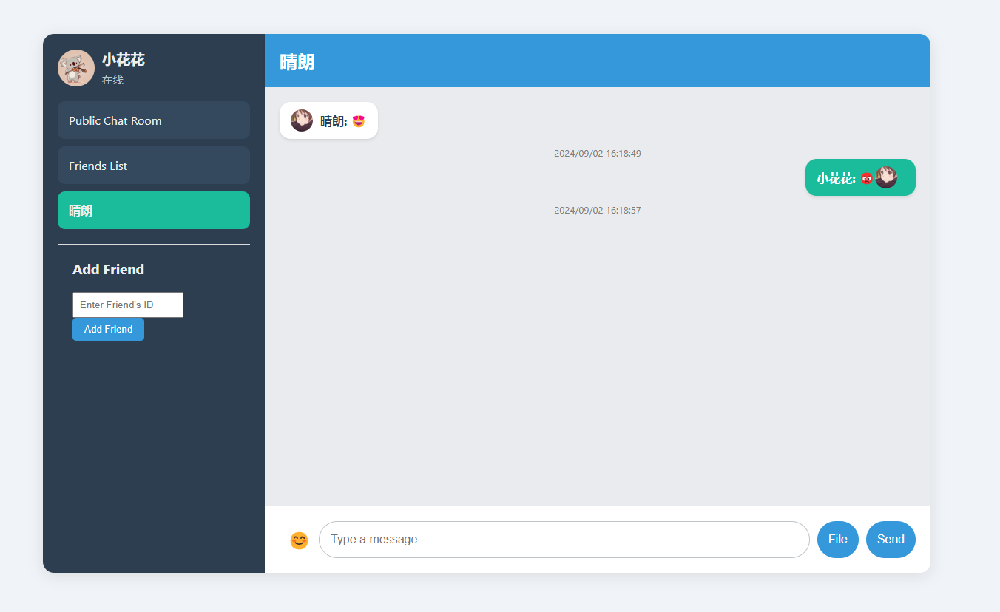

# Tiny IM - A Simple Instant Messaging System

Tiny IM 是一个简单的即时通信系统，旨在提供基本的即时消息传输功能。这个项目使用 Boost Asio 和 SQLite 构建，支持用户注册、登录、好友管理和点对点聊天功能，同时提供了简单的前端页面，它适用于学习和构建基础 IM 系统的参考实现。

## 特性

- **用户注册与登录**：支持新用户注册和用户身份登录身份验证。
- **好友管理**：用户可以添加好友，查看好友列表。
- **点对点聊天**：支持用户之间的即时消息传输。
- **消息持久化**：使用 SQLite 数据库存储消息记录，支持聊天记录的查询。
- **消息缓存**：前端缓存消息记录，提高消息访问速度。
- **WebSocket 通信**：基于 WebSocket 实现实时双向通信。

## 技术栈

1. **编程语言**: C++
2. **网络库**: Boost.Asio Boost.Beast
3. **协议**: WebSocket
4. **数据库**: SQLite
5. **加密**: SHA（目前只有对密码进行哈希时使用了OpenSSL的加密库，后续准备使用RSA对通信过程加密）
   
## 系统结构

1. **网络**: 基于 Boost.Asio 的异步网络通信，支持高效的 I/O 事件处理。
2. **协议**: 采用 WebSocket 协议进行数据传输，使用自定义协议来处理不同类型的消息。
3. **业务逻辑**: 包括用户管理、好友系统、消息处理等功能模块。
4. **数据库**: 使用 SQLite 数据库存储用户信息、好友关系、聊天记录等。

## 安装与使用

### 前置要求

- C++17 或更高版本
- nlohmann json
- SQLite3
- Boost.Asio
- Boost.Beast
- OpenSSL

### 编译步骤
1. 安装依赖：
    
    安装Boost
    ```bash
    sudo apt-get update
    sudo apt-get install libboost-all-dev 
    ```
    安装SQLite3
    ```bash
    sudo apt-get install sqlite3 libsqlite3-dev
    ```
    安装OpenSSL
    ```bash
    sudo apt-get install libssl-dev
    ```
    安装nlohamann json
    ```bash
    git clone https://github.com/nlohmann/json.git
    cd json
    mkdir build
    cd build/
    cmake ..
    make
    make install
    ```
2. 克隆项目仓库并构建：

    ```bash
    git clone https://github.com/RainyDevil/Tiny-IM.git
    cd TinyIM
    make
    ```

3. 运行服务器：

    ```bash
    ./ChatServer
    ```

4. 运行客户端：

    打开front/chat.html客户端网页文件连接到服务器。
    

### 数据库初始化

首次运行时，需要手动初始化数据库，可以执行以下脚本：

```bash
sqlite3 your_db_name.db
```

```sql
 CREATE TABLE users (
    user_id TEXT PRIMARY KEY,  
    username TEXT,             
    password_hash TEXT NOT NULL,  
    salt TEXT NOT NULL,           
    status INTEGER DEFAULT 0      
);

CREATE TABLE friends (
    user_id TEXT,
    friend_id TEXT,
    status INTEGER DEFAULT 0, -- 0: pending, 1: accepted
    PRIMARY KEY (user_id, friend_id),
    FOREIGN KEY (user_id) REFERENCES users(user_id),
    FOREIGN KEY (friend_id) REFERENCES users(user_id)
);

CREATE TABLE messages (
    message_id INTEGER PRIMARY KEY AUTOINCREMENT,
    from_user_id TEXT,
    to_user_id TEXT,
    message_type TEXT,
    content TEXT,
    timestamp INTEGER,
    FOREIGN KEY (from_user_id) REFERENCES users(user_id),
    FOREIGN KEY (to_user_id) REFERENCES users(user_id)
);
```
同时要配置config.json文件，示例文件如下：
```json
{
    "port" : 8080, 
    "host" : "localhost", 
    "db_name" : "chat_app.db",
    "log_level" : "debug",
    "connection_size" : 10  
}
```
## TODO
1. 实现基于RSA的加密通信。
2. 实现聊天群组功能，包括群组管理，消息群发。
3. 增加消息确认功能，保证消息的一致性，有序性。